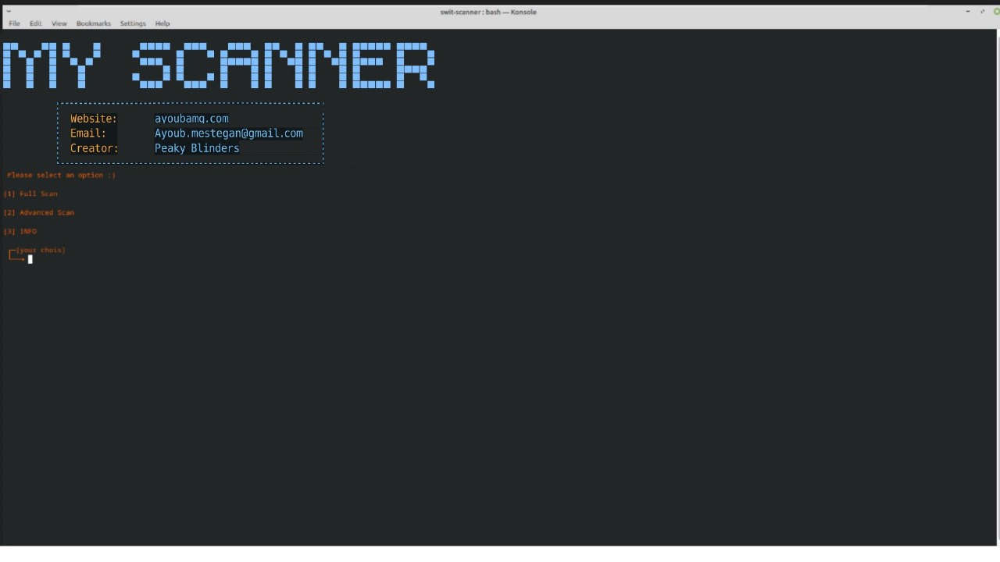

# MY-SCANNER
Very Powerful and Easy Automated Web Penetration Testing Tool<br>
My Scanner uses **whois,whatweb,subfinder,wafw00f,a2sv,dnsenum,sqlmap,wpscan,goofile,ffuf,photon,hakrawler** For Scan<br>
Working with My scanner is easier than you think.
## ScreenShot

## installation
```
1. git clone https://github.com/ayoubamg/Myscanner.git
2. cd Myscanner
3. bash installer.sh
```
If you do not use **kali linux** or **parrot** or ..., run the following command before running step 3
```
sudo bash repository.sh
```
## usage
Just run the following command in the swit-scanner directory
```
./MY-SCANNER
```
OR
```
bash MY-SCANNER
```
## Contact us
WebSite: https://ayoubamg.com<br/>Email:Ayoub.konan6@gmail.com
